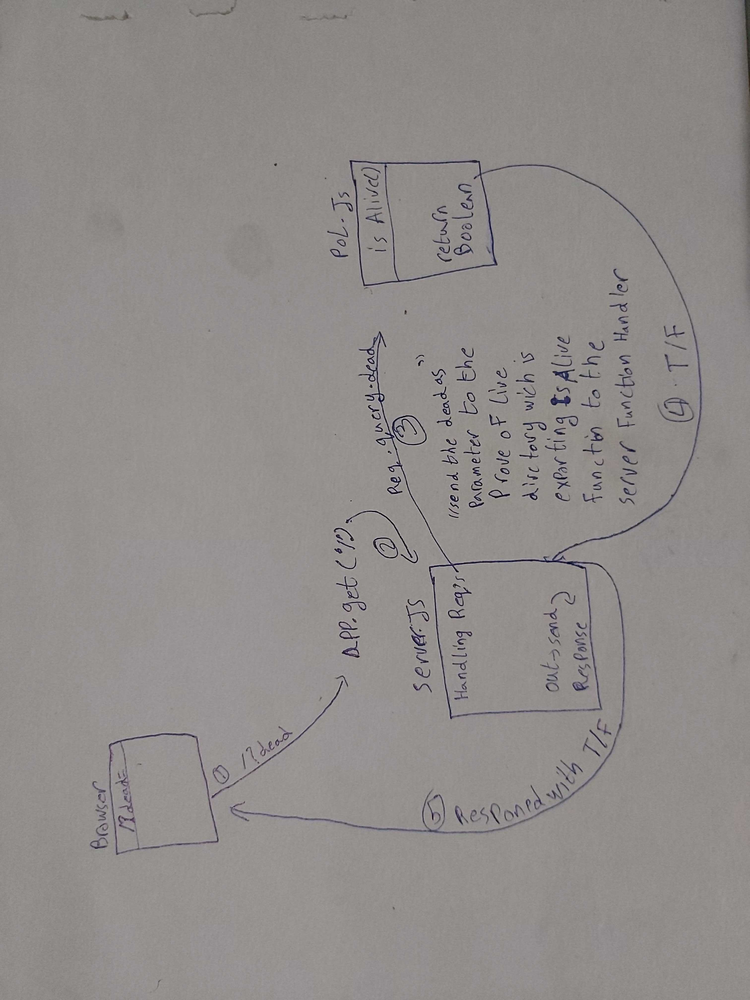

# LAB - 00

<!-- ## Project: Project Name Here -->
## Proof of Life Server

### Author: Abdallah Obaid

### Links and Resources

* [submission PR](https://github.com/Abdallah-401-advanced-javascript/lab-00/pull/1)
* [travis](https://travis-ci.com/github/Abdallah-401-advanced-javascript/lab-00)
<!-- - [ci/cd](http://xyz.com) (GitHub Actions) -->
<!-- - [back-end server url](http://xyz.com) (when applicable) -->
* [front-end application](https://abdallah-lab-00.herokuapp.com/) 

### Documentation
* [jsdoc] (https://abdallah-lab-00.herokuapp.com/docs/)

### Modules
#### `pos.js`
##### Exported Values and Methods

###### `isAlive(dead) -> boolean`
Return true /false to indicate how the server works

### Setup

#### `.env` requirements 
* `PORT` - Port Number
<!-- - `MONGODB_URI` - URL to the running mongo instance/db -->

#### How to initialize/run your application 

* `npm start`
* Endpoint: `/`
  *Returns a boolean 
* Endpoint: `/docs`
  *Returns a JSDoc Documentation pages 
#### How to use your library (where applicable)

#### Tests

* Unit Tests: `npm test`
* Lint Tests: `npm run lint`

<!-- Incomplete Tests: -->

#### UML

